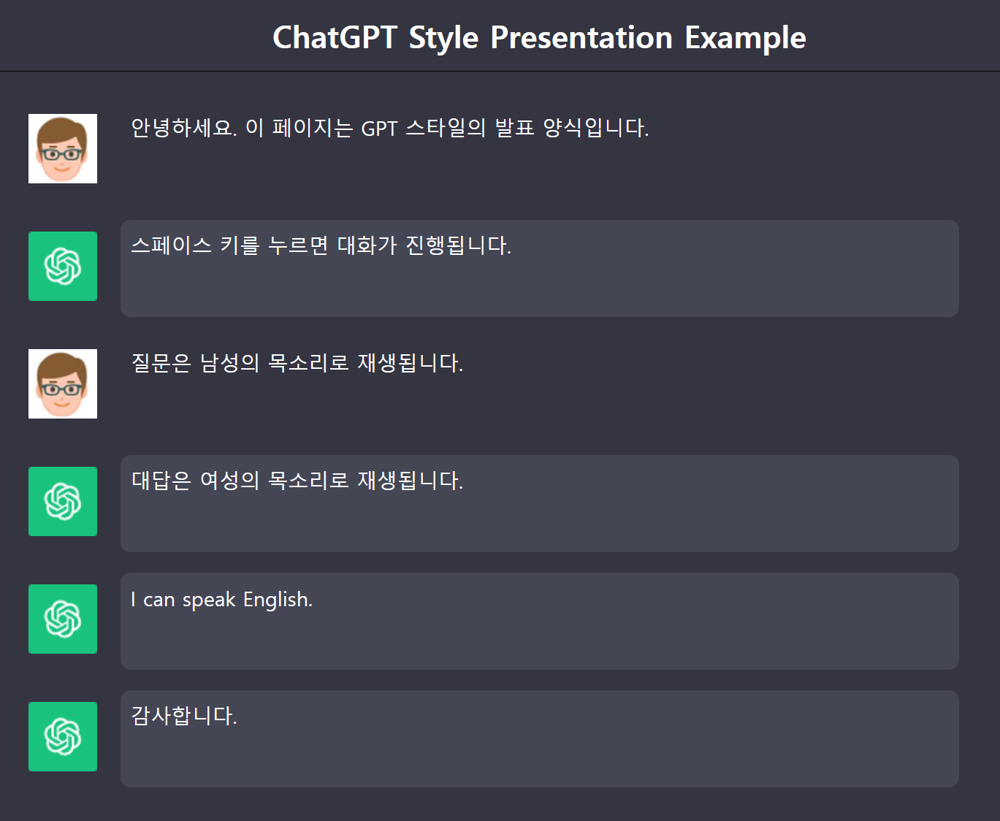

# chat2slide

- ChatGPT 스타일로 HTML을 표현합니다.
- H2는 질문, H3는 대답입니다.
- 음성을 지원합니다. 질문은 남성, 대답은 여성의 목소리로 재생됩니다.
- [SPACE] 키를 눌러 대화를 진행합니다.

## 입력

### HTML 태그를 이용하는 방식

```html
<html>
    <head>
        <meta charset="UTF-8">
        <meta name="viewport" content="width=device-width, initial-scale=1.0">
        <title>ChatGPT Style Presentation Example</title>
        <link rel="stylesheet" type="text/css" href="chat2slide.css">
        <script src="chat2slide.js"></script>
    </head>
    <body>
        <h1>ChatGPT Style Presentation Example</h1>
        <h2>안녕하세요. 이 페이지는 GPT 스타일의 발표 양식입니다.</h2>
        <h3>스페이스 키를 누르면 대화가 진행됩니다.</h3>
        <h2>질문은 남성의 목소리로 재생됩니다.</h2>
        <h3>대답은 여성의 목소리로 재생됩니다.</h3>
        <h3>I can speak English.</h3>
        <h3>감사합니다.</h3>
    </body>
</html>
```

### Markdown 태그를 이용하는 방식

```html
<html>
    <head>
        <meta charset="UTF-8">
        <meta name="viewport" content="width=device-width, initial-scale=1.0">
        <title>ChatGPT Style Presentation Example</title>
        <link rel="stylesheet" type="text/css" href="chat2slide.css">
        <script src="chat2slide.js"></script>
    </head>
    <body>
        <pre class="markdown">
# ChatGPT Style Presentation Example
## 안녕하세요. 이 페이지는 GPT 스타일의 발표 양식입니다.
### 스페이스 키를 누르면 대화가 진행됩니다.
## 질문은 남성의 목소리로 재생됩니다.
### 대답은 여성의 목소리로 재생됩니다.
## I can speak English.
### 감사합니다.
        </pre>
    </body>
</html>
```

## 화면


